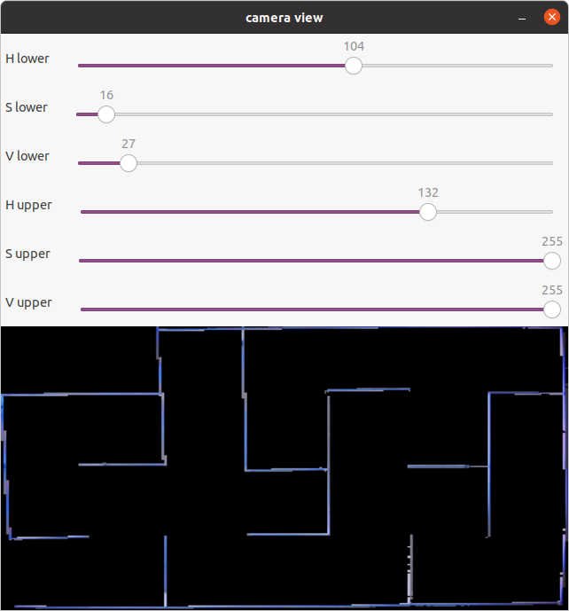
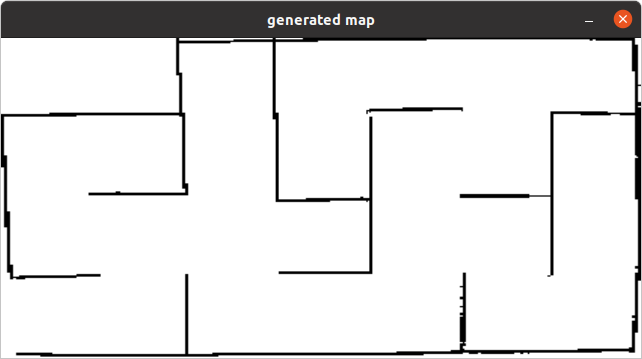

# Rosbot-demo-labyrinth
ROSbot with help of an external computer with a camera is trying to go through the labyrinth. 
## What you need to run this demo
You need to have few things to run this demo:
- ROSbot 2.0 PRO 
- Raspberry Pi and USB camera 
- PC or laptop 
- Labyrinth!

Make sure that you have installed:
- Docker and Docker-Compose for Linux both on your host machine and raspberry
- ROS2 on your host machine

Few notes about making a labyrinth:
- distances between walls should be at least 0.5m
- mark top of walls with different colour (I've used adhesive tape to do it) - this will help to get the right width of walls in the camera view
- try to make labyrinth cover as much space in camera view as possible!

## Set up Husarnet communication
In this project, Husarnet is used to communicate between docker containers and the host machine. Husarnet allows you to create a wirtual network interface on top of your operating system that allows your system to work over the Internet. It is designed with ROS & ROS2 in mind and applies peer-to-peer communication.
Go to https://app.husarnet.com and create a free account or log in if you already have one. Then create a network using the “Create Network” button. Next click “Add element” and save the Join Code of your network. We will need it later.
### Set up the host machine
#### Copy git repository
Create a workspace folder and copy the git repository using `git clone`.
```
mkdir -p rosbot_ws/src
cd rosbot_ws/src
git clone https://github.com/husarion/rosbot-demo-labyrinth.git
```
#### Set up connection for navigation
Edit `.env` file in `rosbot-demo-labyrinth/src/docker_navigation` directory by changing JOINCODE.
```
HOSTNAME=maze-nav2
JOINCODE=fc94:b01d:1803:8dd8:b293:5c7d:7639:932a/xxxxxxxxxxxxxxxxxxxxxxx
```

If you don’t want to install ROS2 on your host machine you can use commands from inside a running container. It is described in the [Using ROS commands from inside container](#using-ros-commands-from-inside-container) section how to do it. If you choose to call ROS2 command from the container then you can skip the rest of the steps in this section.

#### Connect your host machine to Husarnet 
All you need to do is to install Husarnet and connect your host to a Husarnet network is:
```
## 1. Install Husarnet
curl https://install.husarnet.com/install.sh | sudo bash

## 2. Reload systemd starting Husarnet daemon
sudo systemctl restart husarnet

## 3. Join the VPN network
sudo husarnet join ${JOINCODE} ${HOSTNAME}
```
I choose “laptop” as my hostname, if you do the same it will save you some steps.

#### Set up connection on host machine
If you choose a different name for your host than “laptop” you have to change the name of peer address in a cyclonedds.xml file located in `rosbot-demo-labyrinth/src/docker_navigation`. Simply change the name in line 13:
```
<Peer address="laptop"/>
```
To be able to communicate with docker containers from the host machine terminal you need to have Cyclone DDS for ROS2 installed on your host machine (If you are using galactic distribution for ROS2, Cyclone DDS is used as default so you just need to export  CYCLONEDDS_URI):
```
apt install ros-<ros-distro>-rmw-cyclonedds-cpp
export RMW_IMPLEMENTATION=rmw_cyclonedds_cpp
export CYCLONEDDS_URI=file:///home/$USER/rosbot_ws/src/rosbot-demo-labyrinth/src/cyclonedds.xml
``` 
#### Building necessary packages
To be able to call custom interfaces made for this project and use camera configuration node you need to build some packages first. In terminal type:
```
cd ~/rosbot_ws
colcon build --packages-select custom_interfaces maze_robot
```

### Set up ROSbot
The first thing to do is edit `.env` file in `rosbot-demo-labyrinth/src/docker_rosbot` directory by changing JOINCODE. 
To launch ROSbot we only need one folder named `docker_rosbot` from the project. To copy it to ROSbot workspace you can use `scp`. On host machine type:
```
scp -r ~/rosbot_ws/src/rosbot-demo-labyrinth/src/docker_rosbot/ husarion@<ROSBOT_IP>:~/path/to/workspace/docker_rosbot/
```
### Setup camera
In this project, I'm using Raspberry Pi with a USB camera connected to it. Alternatively, you can connect a USB camera to your computer if you have a USB cable long enough. The first thing to do is edit `.env` file in `rosbot-demo-labyrinth/src/docker_camera`  directory by changing JOINCODE. If your camera is not `/dev/video0` then you also have to change that in `docker-compose.yaml` file in the same folder (line 12) and in `maze_cam/config/v4l2_camera_params.yaml`. 

We need to copy three folders from the project repository to launch the camera. Similar to ROSbot we can use `scp`. On the host machine terminal type:
```
scp -r ~/rosbot_ws/src/rosbot-demo-labyrinth/src/docker_camera/ pi@<raspberry_ip>:~/path/to/workspace/docker_camera/
scp -r ~/rosbot_ws/src/rosbot-demo-labyrinth/src/custom_interfaces/ pi@<raspberry_ip>:~/path/to/workspace/custom_interfaces/
scp -r ~/rosbot_ws/src/rosbot-demo-labyrinth/src/maze_cam/ pi@<raspberry_ip>:~/path/to/workspace/maze_cam/
``` 
## Launch demo 
To run the demo you simply have to lunch 3 docker-compose files and then call ROS service to start it.
When launching for the first time devices are not yet added to the Husarnet network so you have to do some dummy starts. Launch navigation and camera like showed below then shut them down. Next launch files in order below.
When launching compose files for the first time building and pulling docker images may take a while.
### Launch camera
Go to your raspberry workspace and then:
```
cd docker_camera/
sudo docker-compose up
```
When we start docker-compose for the camera for the first time container is not yet added to a Husarnet network so it won't be able to communicate with itself. We need to restart it to make everything work fine. 
#### Adjusting camera parameters
There are two main things you have to set to be able to scan your labyrinth properly. 
First, you need to adjust HSV values for the camera. There is a special node that you can use. On host machine run:
```
ros2 run maze_robot configure_camera
```
Two windows should show up. One with sliders for upper and lover HSV values and a view from the camera with a mask. Use sliders to mask out everything except maze walls. Good lighting may help with this process. To learn more about the HSV colour model you can visit: https://programmingdesignsystems.com/color/color-models-and-color-spaces/ (Note that ranges for HSV values are different in python OpenCV than presented in this article). To save HSV values press the spacebar. The second window shows how the map will be saved with a current mask. 

<p align="center">
    
    
</p>


If you don’t want to install ROS2 on your host machine you can run this node from inside a running container. It is described in the [Using ROS commands from inside container](#using-ros-commands-from-inside-container) section how to do it.

The second very important parameter is a resolution which will affect how well you can reflect distances of your maze. A good way to find resolution is to put 2 walls on the edges of the camera view and then measure the distance between them. Next, simply divide distance (in meters) by image width (in pixels). In my case, it was 3.49/420 = 0.828571429. Now you have to past your resolution in `map.yaml` file located in `rosbot-demo-labyrinth/src/maze_bringup/config` directory.

### Launch ROSbot
Go to your ROSbot workspace and then:
```
cd docker_rosbot/
docker-compose up --build
```
### Launch navigation
Go to your workspace and then:
```
cd rosbot-demo-labyrinth/src/docker_navigation/
xhost local:root
sudo docker-compose up --build
```
When we start docker-compose for navigation for the first time container is not yet added to a Husarnet network so it won't be able to communicate with itself. We need to restart it to make everything work fine. 
### Calling start service
After a successful launch, you have to set the robot position (as default it is in the top right corner of the camera view). Go to the terminal where you set up a connection on the host machine. Then update map:
```
ros2 service call /update_map custom_interfaces/srv/UpdateMap
```
Next use the `2D Pose Estimate` button in rviz. AMCL should put the robot in desired starting pose. You may see some leftovers of scans on the map but they will be erased when calling the start service.

If you want you can also try to adjust `origin` values in `map.yaml` file located in `rosbot-demo-labyrinth/src/maze_bringup` directory to change the default starting position of the robot.

To make a robot escape labyrinth you need to call `start` service providing exit x and y position of your labyrinth. In the terminal where you set up a connection on the host machine type (remember to change x and y values to match your labyrinth exit):
```
ros2 service call /start custom_interfaces/srv/Start "{x: 3.3, y: 1.4}"
```
This service will update the map and send the goal position. Then nav2 will generate a path through the labyrinth and make the robot follow it. The generated path may have little zig-zags, but a local trajectory planner should make the robot drive smoothly. You can move some walls and change starting position and call start service again.

### Using ROS commands from inside container
If you don’t want to install ROS2 on your host machine you can use commands from inside a running container. You can do it by using a container that is running navigation:
```
sudo docker container exec -it docker_navigation_maze_navigation_1 bash
```
Then inside the container setup environment:
```
source /opt/ros/galactic/setup.bash
source /ros2_ws/install/setup.bash
export CYCLONEDDS_URI=file:///cyclonedds.xml
```
Now you can use ROS2 commands from inside the container. 

## Using gazebo simulation
There is also a possibility to run this demo in a gazebo simulation. It is  described how to do it here: [ROSbot demo labyrinth simulation in gazebo](https://github.com/husarion/rosbot-demo-labyrinth/tree/main/src/docker_sim#rosbot-demo-labyrinth-simulation-in-the-gazebo)
